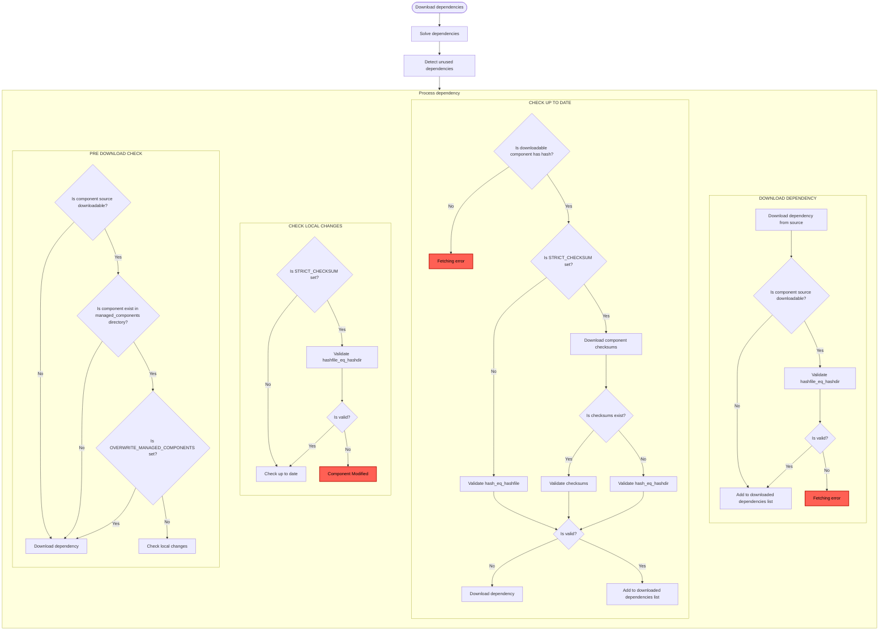

```mermaid
flowchart TD
    classDef exception fill:#ff6054,stroke:#b80c00,stroke-width:2px,color:#000;

    download_deps([Download dependencies])
    solve_deps[Solve dependencies]
    detect_unused[Detect unused dependencies]

    download_deps --> solve_deps
    solve_deps --> detect_unused
    detect_unused --> S1

    subgraph S1[Process dependency]
        direction LR

        subgraph S2[PRE DOWNLOAD CHECK]
            direction TB

            S2_is_source_downloadable{Is component source downloadable?}
            S2_is_component_exist{"Is component exist in managed_components directory?"}
            S2_is_overwrite_set{"Is OVERWRITE_MANAGED_COMPONENTS set?"}
            S2_check_local[Check local changes]
            S2_download_dep[Download dependency]

            S2_is_source_downloadable -- No --> S2_download_dep
            S2_is_source_downloadable -- Yes --> S2_is_component_exist
            S2_is_component_exist -- No --> S2_download_dep
            S2_is_component_exist -- Yes --> S2_is_overwrite_set
            S2_is_overwrite_set -- No --> S2_check_local
            S2_is_overwrite_set -- Yes --> S2_download_dep
        end

        subgraph S3[CHECK LOCAL CHANGES]
            direction TB

            S3_is_strict_set{"Is STRICT_CHECKSUM set?"}
            S3_validate_hashfile_eq_hashdir[Validate hashfile_eq_hashdir]
            S3_check_up_to_date[Check up to date]
            S3_is_valid{Is valid?}
            S3_component_modified[Component Modified]:::exception

            S3_is_strict_set -- No --> S3_check_up_to_date
            S3_is_strict_set -- Yes --> S3_validate_hashfile_eq_hashdir
            S3_validate_hashfile_eq_hashdir --> S3_is_valid
            S3_is_valid -- No --> S3_component_modified
            S3_is_valid -- Yes --> S3_check_up_to_date
        end

        subgraph S4[CHECK UP TO DATE]
            direction TB

            S4_is_component_has_hash{Is downloadable component has hash?}
            S4_is_strict_set{"Is STRICT_CHECKSUM set?"}
            S4_download_checksums[Download component checksums]
            S4_is_checksums_exist{Is checksums exist?}
            S4_validate_checksums[Validate checksums]
            S4_validate_hash_eq_hashfile[Validate hash_eq_hashfile]
            S4_validate_hash_eq_hashdir[Validate hash_eq_hashdir]
            S4_is_valid{Is valid?}
            S4_fetching_error[Fetching error]:::exception
            S4_download_dep[Download dependency]
            S4_add_to_dep_list[Add to downloaded dependencies list]

            S4_is_component_has_hash -- No --> S4_fetching_error
            S4_is_component_has_hash -- Yes --> S4_is_strict_set
            S4_is_strict_set -- No --> S4_validate_hash_eq_hashfile
            S4_is_strict_set -- Yes --> S4_download_checksums
            S4_download_checksums --> S4_is_checksums_exist
            S4_is_checksums_exist -- No --> S4_validate_hash_eq_hashdir
            S4_is_checksums_exist -- Yes --> S4_validate_checksums
            S4_validate_hash_eq_hashfile --> S4_is_valid
            S4_validate_checksums --> S4_is_valid
            S4_validate_hash_eq_hashdir --> S4_is_valid
            S4_is_valid -- No --> S4_download_dep
            S4_is_valid -- Yes --> S4_add_to_dep_list
        end

        subgraph S5[DOWNLOAD DEPENDENCY]
            direction TB

            S5_download_dep[Download dependency from source]
            S5_is_source_downloadable{Is component source downloadable?}
            S5_validate_hashfile_eq_hashdir[Validate hashfile_eq_hashdir]
            S5_is_valid{Is valid?}
            S5_fetching_error[Fetching error]:::exception
            S5_add_to_dep_list[Add to downloaded dependencies list]

            S5_download_dep --> S5_is_source_downloadable
            S5_is_source_downloadable -- No --> S5_add_to_dep_list
            S5_is_source_downloadable -- Yes --> S5_validate_hashfile_eq_hashdir
            S5_validate_hashfile_eq_hashdir --> S5_is_valid
            S5_is_valid -- No --> S5_fetching_error
            S5_is_valid -- Yes --> S5_add_to_dep_list
        end

        S2 ~~~ S3
        S3 ~~~ S4
        S4 ~~~ S5
    end
```
