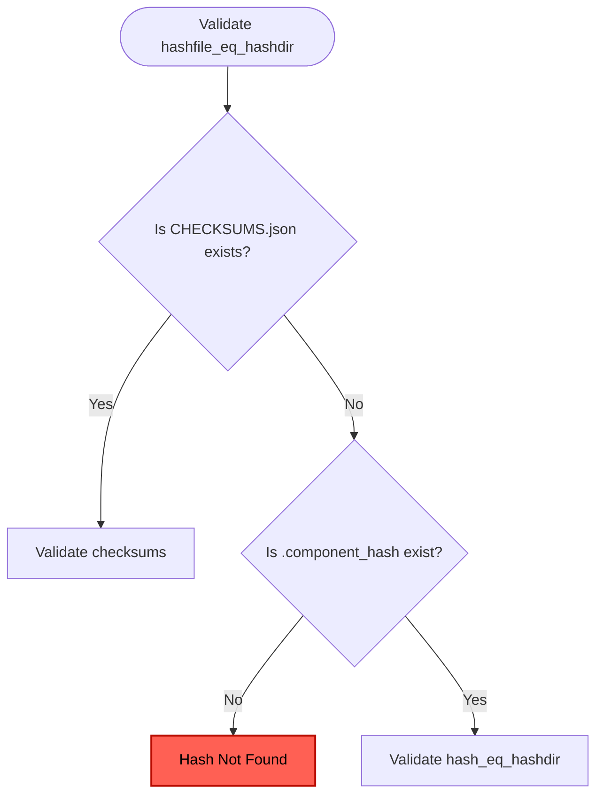

```mermaid
flowchart TD
    classDef exception fill:#ff6054,stroke:#b80c00,stroke-width:2px,color:#000;

    validate_hashfile_eq_hashdir([Validate hashfile_eq_hashdir])
    is_checksums_exist{"Is CHECKSUMS.json exists?"}
    validate_checksums[Validate checksums]
    is_component_hash_exist{"Is .component_hash exist?"}
    validate_hash_eq_hashdir[Validate hash_eq_hashdir]
    hash_not_found[Hash Not Found]:::exception

    validate_hashfile_eq_hashdir --> is_checksums_exist
    is_checksums_exist -- No --> is_component_hash_exist
    is_checksums_exist -- Yes --> validate_checksums
    is_component_hash_exist -- No --> hash_not_found
    is_component_hash_exist -- Yes --> validate_hash_eq_hashdir
```
