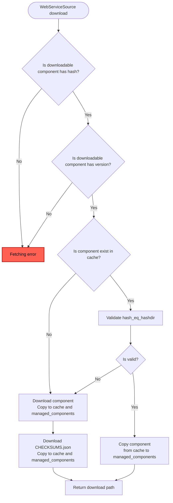

```mermaid
flowchart TD
    classDef exception fill:#ff6054,stroke:#b80c00,stroke-width:2px,color:#000;

    web_service_source_download([WebServiceSource download])
    is_component_has_hash{Is downloadable component has hash?}
    is_component_has_version{Is downloadable component has version?}
    is_component_exist_in_cache{Is component exist in cache?}
    validate_hash_eq_hashdir[Validate hash_eq_hashdir]
    is_valid{Is valid?}
    download_component["
    Download component
    Copy to cache and managed_components
    "]
    download_checksums["
    Download CHECKSUMS.json
    Copy to cache and managed_components
    "]
    copy_from_cache["
    Copy component
    from cache to managed_components
    "]
    return_download_path[Return download path]
    fetching_error[Fetching error]:::exception

    web_service_source_download --> is_component_has_hash
    is_component_has_hash -- No --> fetching_error
    is_component_has_hash -- Yes --> is_component_has_version
    is_component_has_version -- No --> fetching_error
    is_component_has_version -- Yes --> is_component_exist_in_cache
    is_component_exist_in_cache -- No --> download_component
    is_component_exist_in_cache -- Yes --> validate_hash_eq_hashdir
    validate_hash_eq_hashdir --> is_valid
    is_valid -- No --> download_component
    is_valid -- Yes --> copy_from_cache
    copy_from_cache --> return_download_path
    download_component --> download_checksums
    download_checksums --> return_download_path
```
