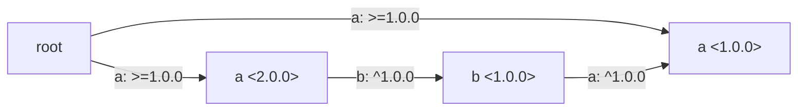
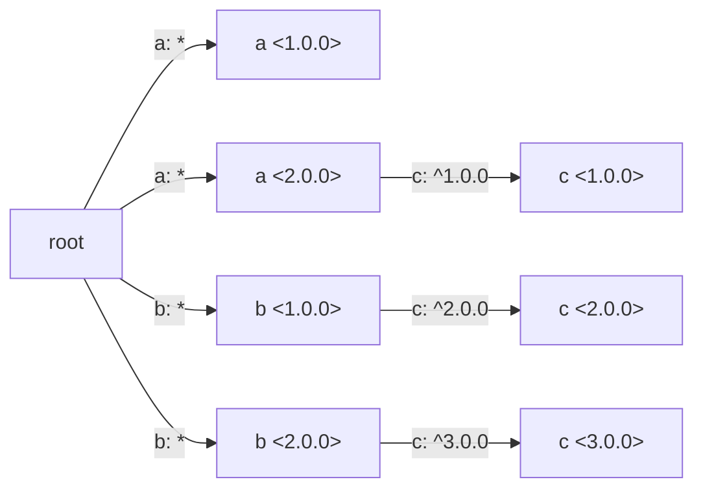
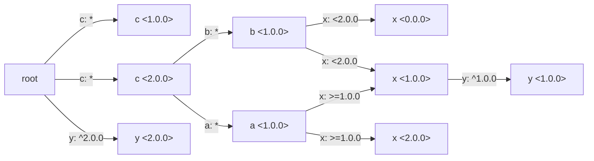
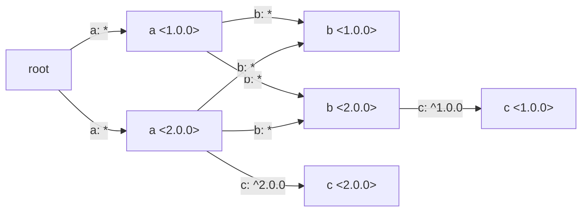

# Test Components

The components under this folder would be uploaded to the ESP Component Registry under namespace `test`. Would be used
for testing with the following scenarios.

## Scenarios

### Circular Dependency

a <1.0.0>

### Diamond Dependency

a <1.0.0> b <2.0.0> c <3.0.0>

### Jump Back After Partially Satisfied

c <1.0.0> y <2.0.0>

### Roll Back the Further the Earlier

a <2.0.0> b <1.0.0> c <2.0.0>
